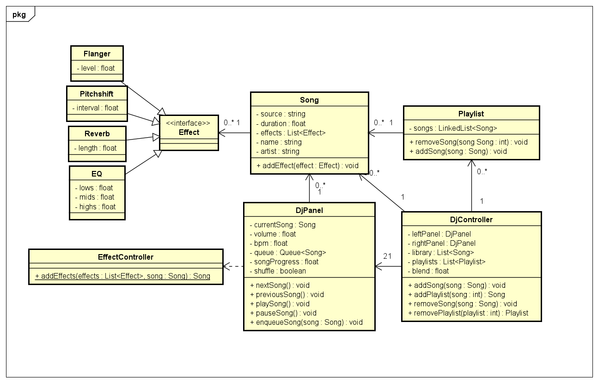
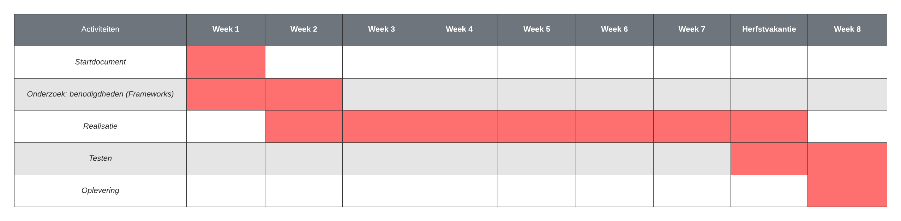

# Startdocument C#2 project - AudioMixingApplication

Startdocument van **Monique Sabong**, **Yannieck Blaauw**, **Victor Peters** en **Chris Klunder**.

## Applicatie Beschrijving

De applicatie die ontwikkeld wordt is een virtueel dj station. Hierbij is de bedoeling dat er een of twee nummers tegelijkertijd afgespeeld kunnen worden en dat je effecten kunt toevoegen aan de nummers (flanger, pitchift, reverb, en EQ.). De applicatie dient als audio player en als audio mixer. Nummers kunnen in de wachtrij gezet worden en in elkaar overlopen wanneer een nummer is afgelopen. Er kunnen afspeellijsten gemaakt worden om nummers makkelijker terug te vinden.

De applicatie zal ontwikkeld worden met **.NET MAUI 6.0** in **Visual Studio 2022**.

### Geluidseffecten

Hieronder een korte beschrijving van de geluidseffecten.

-   **Flanger**: Een flanger is een audio-effect dat een zwevend geluid creëert door twee identieke audiosignalen te combineren en een van hen geleidelijk te vertragen en weer synchroniseren met het andere, waardoor een unieke modulatie ontstaat.

-   **Pitchshift**: Pitchshift is een audio-effect dat de toonhoogte van een geluidssignaal verhoogt of verlaagt, waardoor de frequentie van de oorspronkelijke toon wordt gewijzigd zonder de afspeelsnelheid te beïnvloeden. Hiermee kunnen geluiden hoger of lager klinken.

-   **Reverb**: Reverb is een audio-effect dat een gevoel van ruimtelijke reflectie en diepte aan geluiden toevoegt. Het simuleert het geluid dat ontstaat wanneer geluidsgolven meerdere keren worden weerkaatst in een omgeving, waardoor een natuurlijke akoestische ambiance ontstaat.

-   **EQ (Equalizer)**: Een equalizer is een audio-hulpmiddel waarmee je de balans van verschillende frequentiebanden in een geluidssignaal kunt aanpassen. Hiermee kun je bassen versterken, hoge tonen verzwakken of andere frequentieaanpassingen maken om de klankkleur van het geluid te regelen.

## Lay-out

## Klassendiagram

## Testplan

In dit deel zullen de testcases worden beschreven die worden gebruikt voor het testen van de applicatie.

### Testdata

In de tabellen hieronder worden de data weergegeven die nodig zijn om de applicatie te testen

## Test cases

User interactieve cases:

| Input                                            | Verwachte resultaat                                       | Daadwerkelijke resultaat |
| ------------------------------------------------ | --------------------------------------------------------- | ------------------------ |
| Gebruiker importeert een nummer                  | Nummer wordt in het paneel weergegeven                    | ...                      |
| Gebruiker importeert een tweede nummer           | Tweede nummer wordt ook in het paneel weergegeven         | ...                      |
| Gebruiker speelt één of meer nummers tegelijk af | Nummer(s) worden afgespeeld                               | ...                      |
| Gebruiker pauzeert één of meerdere nummers       | Nummer(s) worden gepauzeerd                               | ...                      |
| Gebruiker skipt een nummer                       | Het volgend nummer in de queue wordt afgespeeld           | ...                      |
| Gebruiker gaat naar het nummer overzicht         | Alle nummers in de library worden weergegeven.            | ...                      |
| Gebruiker past het volume aan                    | Het volume wordt aangepast                                | ...                      |
| Gebruiker voegt een effect toe aan het nummer    | Het nummer krijgt het effect dat de gebruiker toegevoegd. | ...                      |
| Gebruiker maakt een afspeellijst aan             | Er wordt een afspeellijst aangemaakt.                     | ...                      |
| Gebruiker voegt een effect toe aan het nummer    | Het nummer krijgt het effect dat de gebruiker toegevoegd. | ...                      |

## Planning

Om de voortgang van dit project te bewaken, is er een planning gemaakt. Deze planning bevat in grote lijnen hetgeen waarmee wij ons bezig zullen houden per week tot de deadline. Er kan natuurlijk afgeweken worden van deze planning, maar het is het doel om deze in grote lijnen te volgen.

Dit project is begonnen op maandag 2 oktober 2023 en zal eindigen op vrijdag 1 december 2023.

## Literatuurlijst

-   Britch, D. Gechev I. jconrey (2023, 30 januari) What is .NET MAUI? Geraadpleegd op 30 april 2023, van <https://learn.microsoft.com/en-us/dotnet/maui/what-is-maui?view=net-maui-7.0>