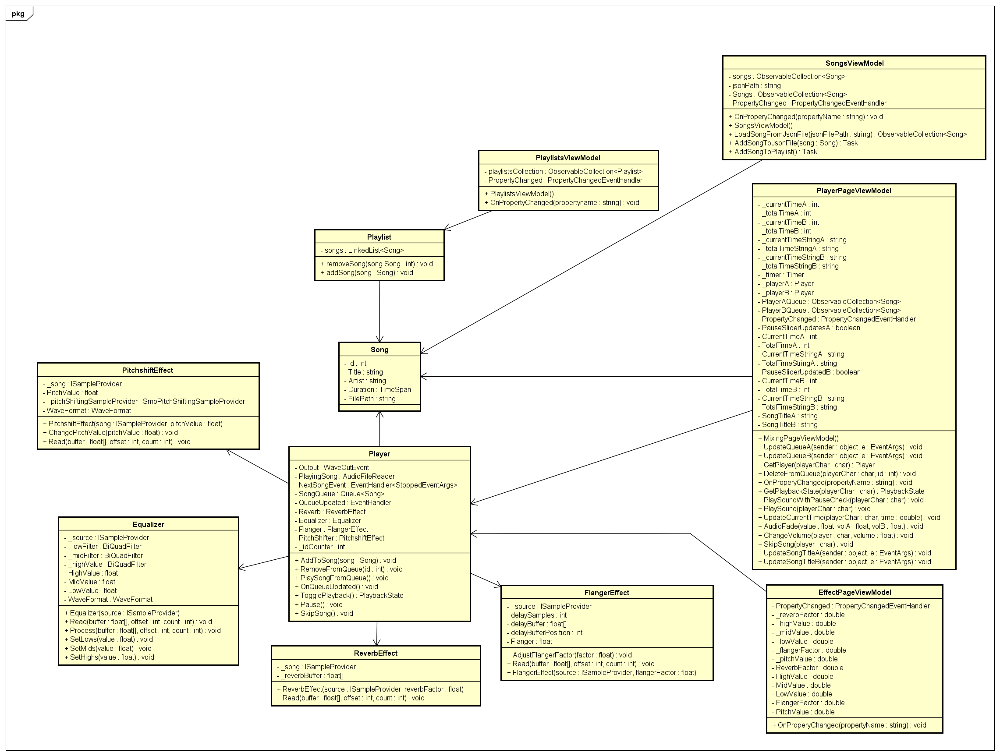
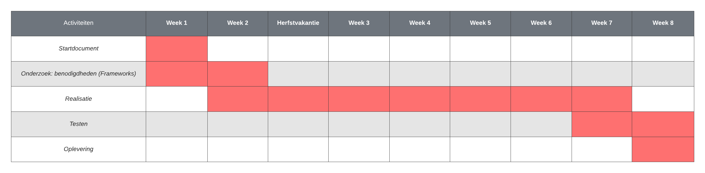

# Startdocument C#2 project - AudioMixingApplication

Startdocument van **Monique Sabong**, **Yannieck Blaauw**, **Victor Peters** en **Chris Klunder**.

## Applicatie Beschrijving

De applicatie die ontwikkeld wordt is een virtueel dj station. Hierbij is de bedoeling dat er een of twee nummers tegelijkertijd afgespeeld kunnen worden en dat je effecten kunt toevoegen aan de nummers (flanger, pitchift, reverb, en EQ.). De applicatie dient als audio player en als audio mixer. Nummers kunnen in de wachtrij gezet worden en in elkaar overlopen wanneer een nummer is afgelopen. Er kunnen afspeellijsten gemaakt worden om nummers makkelijker terug te vinden.

De applicatie zal ontwikkeld worden met **.NET MAUI 6.0** in **Visual Studio 2022**.

### Geluidseffecten

Hieronder een korte beschrijving van de geluidseffecten.

- **Flanger**: Een flanger is een audio-effect dat een zwevend geluid creëert door twee identieke audiosignalen te combineren en een van hen geleidelijk te vertragen en weer synchroniseren met het andere, waardoor een unieke modulatie ontstaat.
- **Pitchshift**: Pitchshift is een audio-effect dat de toonhoogte van een geluidssignaal verhoogt of verlaagt, waardoor de frequentie van de oorspronkelijke toon wordt gewijzigd zonder de afspeelsnelheid te beïnvloeden. Hiermee kunnen geluiden hoger of lager klinken.
- **Reverb**: Reverb is een audio-effect dat een gevoel van ruimtelijke reflectie en diepte aan geluiden toevoegt. Het simuleert het geluid dat ontstaat wanneer geluidsgolven meerdere keren worden weerkaatst in een omgeving, waardoor een natuurlijke akoestische ambiance ontstaat.
- **EQ (Equalizer)**: Een equalizer is een audio-hulpmiddel waarmee je de balans van verschillende frequentiebanden in een geluidssignaal kunt aanpassen. Hiermee kun je bassen versterken, hoge tonen verzwakken of andere frequentieaanpassingen maken om de klankkleur van het geluid te regelen.

## Lay-out

## Controls

In dit hoofdstuk worden de functionaliteiten van de applicatie doorlopen en hoe ze dienen gebruikt te worden.

### Player page

Wanneer de applicatie voor het eerst opgestart wordt bevind de gebruiker zich op de player page. Op deze pagina kunnen nummers afgespeeld worden. De player is opgedeeld in 2 players. A (links) en B (rechts) genoemd in de code. Deze zijn inentiek en hebben beide hun eigen afspeelfunctionaliteiten. In het midden, tussen de 2 players zit een blauw/roze balk. Hiermee kan aangegeven worden hoeveel van welke player afgespeeld wordt; helemaal naar links betekend 100% linker player 0% rechter player, in het midden betekend 50%/50%, etc.

#### Audio controls

Onder de afbeelding van de record player staan de audio controls. Deze komen vrijwel overeen met audio controls die te vinden zijn in bijvooreeld YouTube of Spotify. De pijl naar rechts skipt een nummer en speelt de volgende in de queue. de driehoek start, pauzeerd en hervat het afspelen van een nummer. De knop naar links herstart het nummer. Onder deze drie knoppen staat de titel en artiest van het nummer die momenteel af worden gespeeld. Hieronder staat de progress bar. Deze valt ook weer te vergelijken met die van YouTube of Spotify. Je kan er de voortgang van het nummer zien en ook het nummer doorspoelen of terugspoelen. Aan het einde van een nummer wordt automatisch de volgende in de queue afgespeeld. In met midden van de pagina staan twee verticale sliders. Deze passen het volume aan van de linker en rechter player. Naast de titel en artiest text staat een filter knop. Deze knop stuurt je door naar de filter pagina. Hier wordt later meer over uitgelegd.

#### Queue

De onderste helft van het scherm is de queue. Hier in staan alle nummers die momenteel in de wachtrij staan om afgespeeld te worden. Ook hier is weer een linker (A) en rechter (B) queue voor beide players. Ook kan een nummer handmatig uit de queue gehaald worden. Als een nummer aan de beurt is in de queue (boven aan staat) en het nummer wordt afgespeeld wordt het nummer automatisch uit de queue gehaald.

### Song pagina

Een nummer kan in de queue gezet worden in de song pagina. Deze pagina is te vinden door op de Import knop de drukken. Op de song pagina kan een nummer toegevoegd worden aan de queue door op "Add to queue A/B" te drukken. Dit voegt het nummer toe aan queue A of B afhankelijk van de knop. Op de song pagina kan één of meerdere nummers geimporteerd worden. Dit is te doen met de knoppen links bovenin. Hier wordt gevraagd om een titel, artiest en mp3 bestand in het geval dan de enkele song import. Bij de multiple song import wordt de metedata van het mp3 bestand gebruikt om deze data uit te halen. Het grootste gedeelte van de pagina is het song overzicht. Hierin staan alle geimporteerde nummers. Elk geimporteerde nummer heeft een knop om ze aan de queue toe te voegen.

### Playlist pagina

### Filter pagina

Zoals eerder genoemd, deze pagina is naar toe te navigeren door op de knop te drukken naast de nummer titel en artiest op de player pagina. Op deze pagina zijn verschillende effecten aan te passen. De effecten zijn: reverb, equalizer (highs, mids en lows boosts), flanger en pitchshift. Deze effecten staan uitgelegd in het hoofdstuk [Geluidseffecten](#geluidseffecten). De effecten kunnen alleen aangepast worden als er momenteel een nummer speelt. Effecten worden gereset wanneer een nieuw nummer afspeeld.

## Klassendiagram

## Testplan

In dit deel zullen de testcases worden beschreven die worden gebruikt voor het testen van de applicatie.

### Testdata

In de tabellen hieronder worden de data weergegeven die nodig zijn om de applicatie te testen

## Test cases

User interactieve cases:

| Input                                              | Verwachte resultaat                                       | Daadwerkelijke resultaat |
| -------------------------------------------------- | --------------------------------------------------------- | ------------------------ |
| Gebruiker importeert een nummer                    | Nummer wordt in het paneel weergegeven                    | ...                      |
| Gebruiker importeert een tweede nummer             | Tweede nummer wordt ook in het paneel weergegeven         | ...                      |
| Gebruiker speelt één of meer nummers tegelijk af | Nummer(s) worden afgespeeld                               | ...                      |
| Gebruiker pauzeert één of meerdere nummers       | Nummer(s) worden gepauzeerd                               | ...                      |
| Gebruiker skipt een nummer                         | Het volgend nummer in de queue wordt afgespeeld           | ...                      |
| Gebruiker gaat naar het nummer overzicht           | Alle nummers in de library worden weergegeven.            | ...                      |
| Gebruiker past het volume aan                      | Het volume wordt aangepast                                | ...                      |
| Gebruiker voegt een effect toe aan het nummer      | Het nummer krijgt het effect dat de gebruiker toegevoegd. | ...                      |
| Gebruiker maakt een afspeellijst aan               | Er wordt een afspeellijst aangemaakt.                     | ...                      |
| Gebruiker voegt een effect toe aan het nummer      | Het nummer krijgt het effect dat de gebruiker toegevoegd. | ...                      |

## Planning

Om de voortgang van dit project te bewaken, is er een planning gemaakt. Deze planning bevat in grote lijnen hetgeen waarmee wij ons bezig zullen houden per week tot de deadline. Er kan natuurlijk afgeweken worden van deze planning, maar het is het doel om deze in grote lijnen te volgen.

Dit project is begonnen op maandag 2 oktober 2023 en zal eindigen op vrijdag 1 december 2023.

## Literatuurlijst

- Britch, D. Gechev I. jconrey (2023, 30 januari) What is .NET MAUI? Geraadpleegd op 30 april 2023, van [https://learn.microsoft.com/en-us/dotnet/maui/what-is-maui?view=net-maui-7.0](https://learn.microsoft.com/en-us/dotnet/maui/what-is-maui?view=net-maui-7.0)
